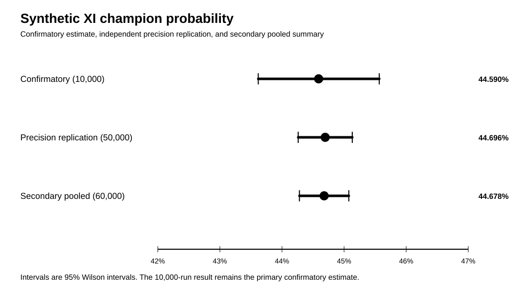
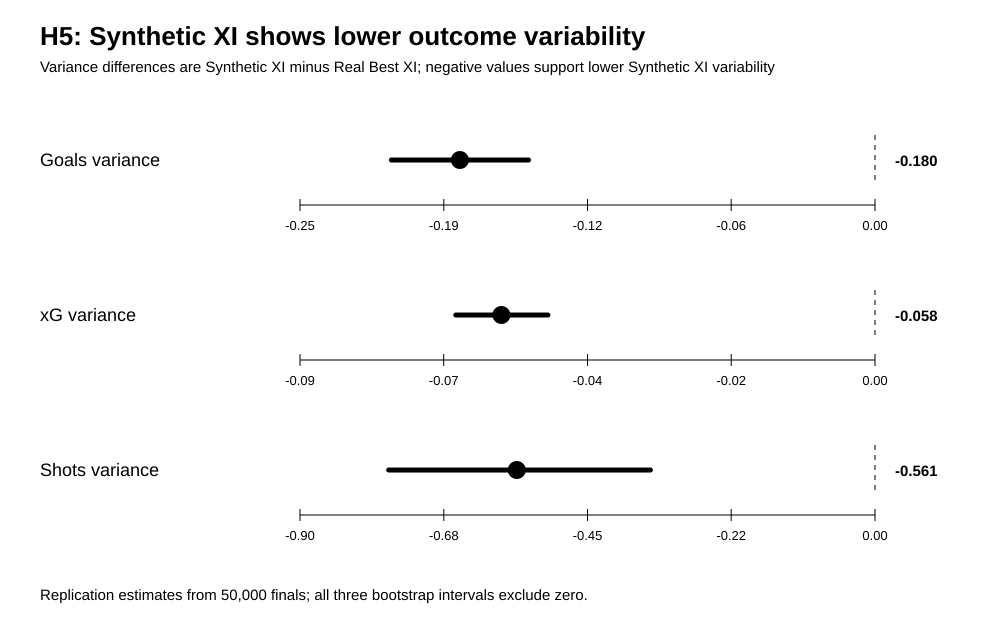
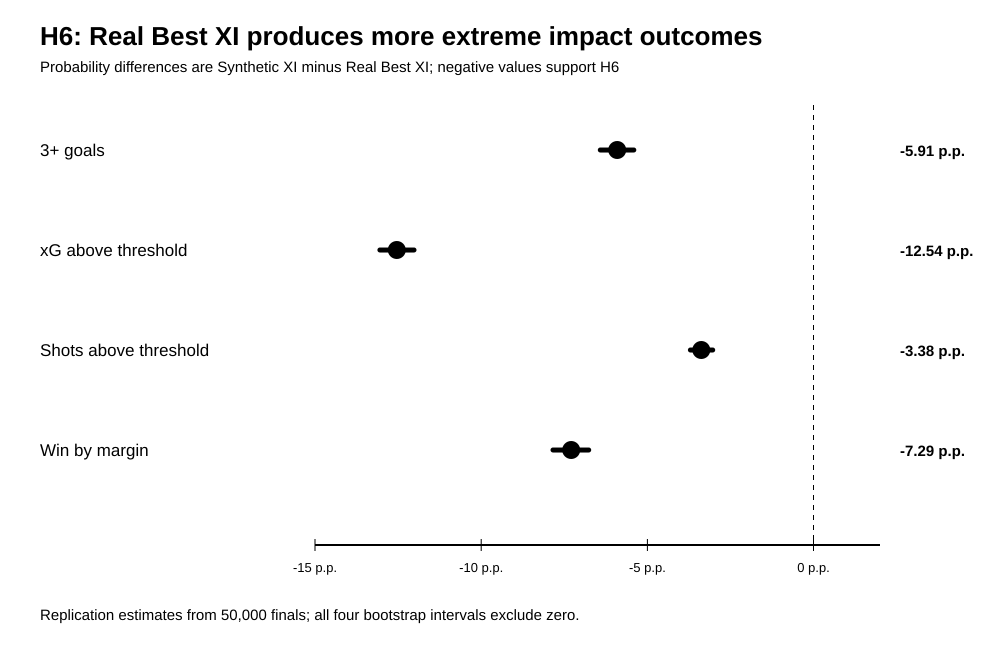
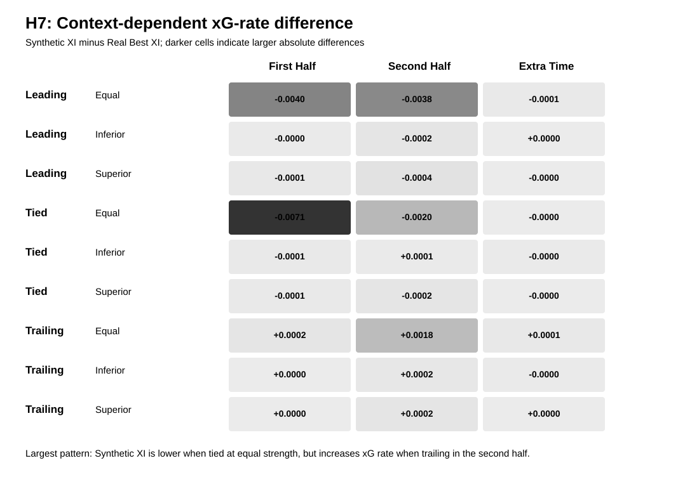
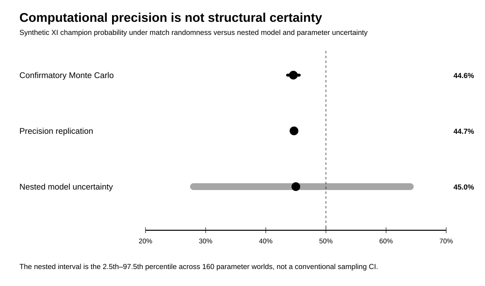

# Master Scientific Results Report — Official Experiment v1

## Purpose and epistemic status

This document consolidates the frozen computational evidence for the comparison between the **Synthetic XI** and the **Real Best XI**. It is the editorial source of truth for the Q1 manuscript. It does not modify the simulator, player rosters, parameters, seeds, preregistration, or any previously published result.

The evidence hierarchy is:

1. **Primary confirmatory result:** 10,000 finals, master seed `2026073001`.
2. **Independent precision replication:** 50,000 finals, master seed `2026073102`.
3. **Secondary pooled precision summary:** 60,000 finals, reported only to summarize Monte Carlo precision.
4. **Sensitivity and nested uncertainty analyses:** used to evaluate specification dependence and structural uncertainty, not to replace the frozen primary estimand.

The strongest defensible claim is:

> Under the preregistered primary specification of the frozen official engine, the Real Best XI was more likely than the Synthetic XI to become champion. This result was reproduced with an independent seed and substantially greater Monte Carlo precision. However, the magnitude and even direction of the advantage are not invariant across all plausible model specifications and parameter worlds.

## Frozen design

- Engine: `complete_final_official_v1`
- Primary profile construction: Top 20 eligible players, 10% trimmed mean
- Primary minutes threshold: 900
- Frozen rosters: 26 registered players per team
- Frozen starting elevens and bench compatibility rules
- Neutral home advantage
- Paired context where allowed
- Confirmatory simulations: 10,000
- Precision-replication simulations: 50,000
- No early stopping
- No parameter, roster, code, or hypothesis changes after observing results
- H5, H6, and H7 operationalized before the confirmatory run
- Source hashes checked against the release authorization

## Primary outcome

### Confirmatory experiment

The Synthetic XI became champion in **44.590%** of the 10,000 finals (95% Wilson interval: **43.618%–45.566%**). The Real Best XI became champion in **55.410%** (95% Wilson interval: **54.434%–56.382%**). The estimated advantage for the Real Best XI was therefore **10.820 percentage points**.

In regulation time:

- Synthetic XI win: 32.07%
- Draw: 25.53%
- Real Best XI win: 42.40%

### Independent precision replication

The Synthetic XI became champion in **44.696%** of the 50,000 replicated finals (95% Wilson interval: **44.261%–45.132%**). The Real Best XI became champion in **55.304%** (95% Wilson interval: **54.868%–55.739%**).

The replication differed from the confirmatory estimate by only **0.106 percentage points**. The preregistered maximum difference under the Monte Carlo consistency rule was **1.067 percentage points**. Direction, precision, and consistency therefore passed with substantial margin.

### Secondary pooled precision summary

Pooling the two independent runs only as a secondary numerical summary gives:

- Synthetic XI champion probability: **44.678%**
- 95% Wilson interval: **44.281%–45.076%**
- Real Best XI champion probability: **55.322%**

The pooled estimate must not be presented as replacing the primary confirmatory result.

## H5 — Outcome variability

H5 predicted that the Synthetic XI would show lower outcome variability. All three variance estimands were negative in both the confirmatory run and the 50,000-run replication.

### Precision-replication estimates

| Estimand: Synthetic minus Real | Estimate | 95% bootstrap interval |
|---|---:|---:|
| Goals variance difference | -0.180 | [-0.210, -0.151] |
| xG variance difference | -0.058 | [-0.066, -0.051] |
| Shots variance difference | -0.561 | [-0.761, -0.352] |

The direction was consistent with the 10,000-run estimates: goals variance -0.254, xG variance -0.061, and shots variance -0.722. H5 is therefore supported for the preregistered variance estimands.

However, lower variability was accompanied by a less favorable offensive lower tail:

- Zero-goal probability difference: **+5.604 percentage points**
- Offensive lower-tail difference: **+7.764 percentage points**

This distinction is theoretically important. The Synthetic XI was more regular in variance terms but also more likely to occupy low-output states. Lower variance must therefore not be interpreted automatically as superior collective performance, resilience, or reliability.

## H6 — Extreme impact outcomes

H6 predicted that the Real Best XI would generate more extreme impact outcomes. All four threshold estimands were negative in both runs, meaning the relevant outcomes occurred more often for the Real Best XI.

### Precision-replication estimates

| Estimand: Synthetic minus Real | Difference | 95% bootstrap interval |
|---|---:|---:|
| Probability of scoring 3+ goals | -5.908 p.p. | [-6.416, -5.408] |
| Probability of exceeding the xG threshold | -12.538 p.p. | [-13.048, -12.020] |
| Probability of exceeding the shots threshold | -3.378 p.p. | [-3.706, -3.034] |
| Probability of winning by the preregistered margin | -7.290 p.p. | [-7.838, -6.766] |

The corresponding confirmatory estimates were -6.110, -12.330, -3.110, and -6.760 percentage points. The replication reproduced both the direction and approximate magnitude of H6.

At the 90th and 95th percentiles, the teams reached the same integer goal thresholds, but the Real Best XI retained higher xG and shot quantiles. The evidence supports a distinction between the Synthetic XI's lower variance and the Real Best XI's greater capacity for high-impact offensive realizations.

## H7 — Context-dependent relative advantage

H7 predicted that the relative advantage would depend on score state, numerical state, and match phase. The analysis estimated 81 interaction cells, using the simulation—not the individual event—as the uncertainty unit.

The 50,000-run replication reveals three interpretable patterns:

1. **When tied at equal numerical strength**, the Synthetic XI had lower xG-event rates than the Real Best XI:
   - First half: -0.00710, 95% interval [-0.00766, -0.00655]
   - Second half: -0.00195, 95% interval [-0.00234, -0.00154]
2. **When trailing at equal numerical strength in the second half**, the Synthetic XI increased production relative to the Real Best XI:
   - Shots rate difference: +0.01603, 95% interval [0.01402, 0.01806]
   - Goals rate difference: +0.00216, 95% interval [0.00091, 0.00345]
   - xG rate difference: +0.00183, 95% interval [0.00142, 0.00223]
3. **Many extra-time and rare numerical-state cells remained close to zero**, with intervals crossing zero.

The most defensible interpretation is that the Synthetic XI's relative offensive behavior was state-responsive: it underperformed in neutral tied states but intensified production when trailing, particularly in the second half. H7 should be described as a heterogeneous interaction pattern rather than reduced to a single global coefficient.

## Sensitivity analysis

Nine preregistered sensitivity scenarios were run with 750 simulations per scenario. All event-sanity and discipline gates passed.

Across these scenarios, the Synthetic XI champion probability ranged from **35.467% to 58.800%**. The direction of the primary advantage was therefore **not consistent across all sensitivity scenarios**.

This demonstrates that the substantive conclusion depends on choices such as Top-N profile construction, minimum-minutes threshold, role-classification variant, and relative coordination assumptions. It would be misleading to describe the 55.4% versus 44.6% result as a universal property of “human versus synthetic teams.”

## Nested structural uncertainty

The nested analysis sampled **160 parameter worlds**, with **100 matches per world**, for 16,000 simulated finals. It incorporated player-profile uncertainty, role-classification sensitivity, Top-N and minimum-minutes sensitivity, coordination, engine parameters, paired context, and match randomness.

For the Synthetic XI champion probability:

- Mean across parameter worlds: **45.144%**
- Median: **45.000%**
- 10th–90th percentile: **35.000%–58.000%**
- 2.5th–97.5th percentile: **27.975%–64.025%**

The Real Best XI was more likely than the Synthetic XI in **71.875%** of sampled parameter worlds.

This result creates a necessary two-level interpretation:

- **Monte Carlo uncertainty is small:** given the frozen primary specification, the estimated champion probability is highly precise and replicable.
- **Structural uncertainty is large:** across plausible model and profile assumptions, the magnitude and direction can change.

## Calibration and integrity

The 50,000-run replication produced mean regulation goals of 2.936, mean total goals including extra time of 3.166, mean shots of 19.397, mean shots on target of 9.653, mean fouls of 25.129, mean yellow cards of 3.178, mean red cards of 0.144, an extra-time probability of 25.068%, and a penalty-shootout probability of 12.534%.

All mandatory release gates passed: source-hash equality, release authorization, event sanity, discipline calibration, orientation equivalence, seed stability, H5–H7 presence, precision, Monte Carlo consistency, and no post-result tuning.

## Claim hierarchy for the manuscript

### Claims supported directly

1. Under the frozen primary specification, the Real Best XI was more likely to become champion.
2. The primary estimate was reproduced by an independent 50,000-run simulation with a different seed.
3. The Synthetic XI showed lower variance in goals, xG, and shots.
4. The Real Best XI generated more extreme offensive outcomes.
5. Relative performance depended on score state, numerical state, and match phase.
6. The primary result is computationally precise but structurally specification-dependent.

### Claims that must not be made

1. The Real Best XI would defeat the Synthetic XI in a real physical match.
2. Human teams are universally superior to synthetic or algorithmically composed teams.
3. Lower variance means greater quality, reliability, or resilience.
4. The 55.4% estimate is robust to every plausible modeling decision.
5. The simulation establishes causal effects of human or synthetic identity.
6. The pooled 60,000 estimate is a new confirmatory endpoint.

## Central theoretical interpretation

The findings do not support a simple human-versus-machine winner narrative. They reveal a trade-off between **regularity and extremity**.

The Synthetic XI exhibited lower variance, indicating a narrower distribution of offensive outcomes, yet it also showed a heavier low-output tail. The Real Best XI was less regular but more capable of generating extreme xG, shot, goal, and margin outcomes. This suggests that algorithmic aggregation of positional archetypes can produce consistency without reproducing the high-impact heterogeneity associated with elite individual talent.

The study's contribution is methodological and theoretical: it separates match randomness from structural uncertainty and frames synthetic collective intelligence as a distinct performance regime characterized by different distributions, tails, and context-responsive behaviors.

## Editorial decision

No additional Monte Carlo run is scientifically necessary for the primary paper. The next work should focus on theoretical positioning, external literature, full method reporting, and manuscript construction. Any future simulation should be treated as a new registered analysis rather than an informal extension of official v1.
